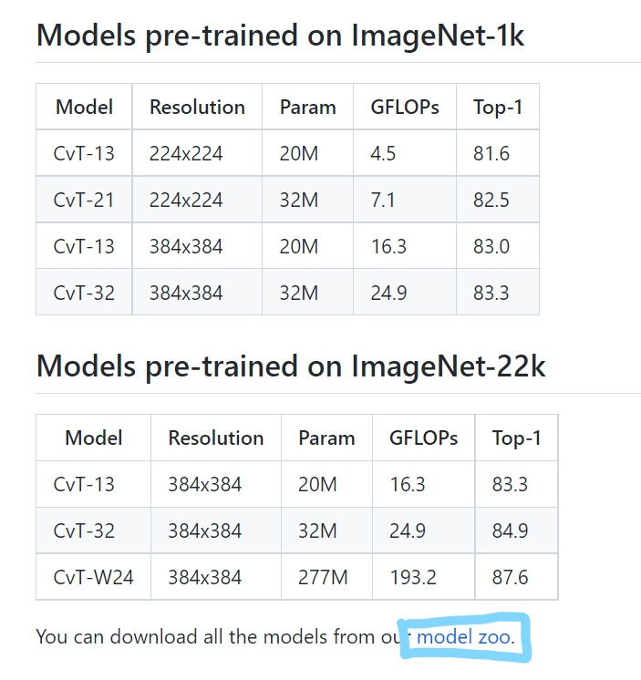

## 论文复现指南
本文为第一次复现论文的同学提供论文复现指南。内容分为梳理复现论文的步骤，并且附加在每一步可能遇到的问题，达到减轻同学们减轻论文复现的压力。您可以根据本文的步骤，高效完成论文复现工作。以下把需要复现的模型称为<model>。接下来，我会用我复现的cvt举例，完成具体步骤的举例。
## 实现一个<model>.py文件
此文件的主体为一个model的class，还有一个build_<model>的函数，负责生成<model>类的实例。

在这个阶段，你需要找到论文原文，参考知乎、CSDN等对模型的分析，理解论文的大概算法。然后找到论文中对应链接的官方实现仓库。这里需要注意，一般一篇论文有其他的实现方式，我们统一采用官方的实现方式。(例如，cvt模型的官方实现仓库是<https://github.com/microsoft/CvT/tree/4cedb05b343e13ab08c0a29c5166b6e94c751112>)

这里你需要寻找对应模型的预训练模型，预训练模型对测试你的模型正确行具有关键作用，所以如果没有找到预训练模型，最好和老师联系说明情况。

找到官方实现仓库之后，接下来需要仿照官方的实现实现一个基于paddle的模型。你主要需要做如下的几件事。

1. 把pytorch的api转化为paddle的api，这一块，需要你查阅paddle官方文档，官方文档中包括了pytorch和paddle的API对照表，和具体每个函数的作用。
2. 对于部分具体函数的实现，paddle和pytorch有一些区别，可以参考具体的，`模型实现具体注意事项`。

